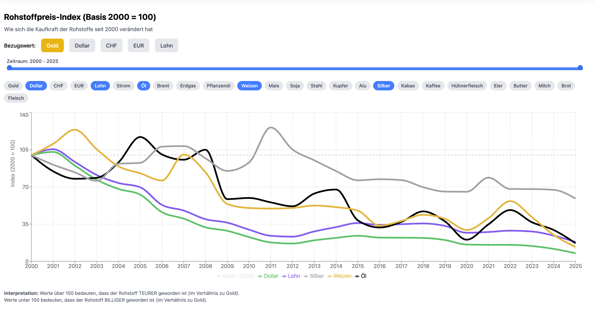

# Commodities Projekt

Dieses Projekt ist eine Webanwendung, die mit React, TypeScript und Vite erstellt wurde und verschiedene Rohstoffdaten anzeigt. Es bietet eine einfache und effiziente Möglichkeit, Rohstoffinformationen zu visualisieren und zu interagieren, mit Fokus auf die Kaufkraft von Rohstoffen im Vergleich zu verschiedenen Basen seit dem Jahr 2000.

## Funktionen

*   **Interaktives Liniendiagramm**: Visualisiert den Preisindex verschiedener Rohstoffe im Zeitraum 2000-2025.
*   **Dynamische Basisauswahl**: Ermöglicht es Benutzern, die "Basis"-Währung oder den Wert zu wechseln, gegen den alle anderen Rohstoffe gemessen werden. Die Optionen umfassen:
    *   **Gold**
    *   **Dollar** (USD)
    *   **CHF** (Schweizer Franken)
    *   **EUR** (Euro)
    *   **Lohn** (Löhne)
*   **Anpassbare Vergleiche**: Benutzer können bestimmte Rohstoffe aktivieren und deaktivieren, um die Diagrammansicht anzupassen. Unterstützte Rohstoffe:
    *   **Währungen/Indizes**: Gold, Dollar, CHF, EUR, Lohn
    *   **Energie**: Strom, Öl, Brent-Rohöl, Erdgas
    *   **Metalle**: Stahl, Kupfer, Aluminium, Silber
    *   **Landwirtschaft**: Weizen, Mais, Soja, Pflanzenöl, Kakao, Kaffee
    *   **Lebensmittel**: Hühnerfleisch, Eier, Butter, Milch, Brot, Fleisch
*   **Detaillierte Datentabelle**: Eine umfassende Tabelle mit den rohen Preisdaten aller Rohstoffe über alle Jahre.



## Funktionsweise

Die Anwendung berechnet einen **Preisindex** für jeden Rohstoff, normalisiert auf das Jahr 2000 (Index = 100).

1.  **Basis auswählen**: Wenn Sie eine Basis wählen (z. B. "Gold"), berechnet die Anwendung, wie viel dieser Basis benötigt wurde, um den Rohstoff in jedem Jahr zu kaufen.
2.  **Normalisierung**: Dieses Verhältnis wird dann normalisiert, so dass der Wert im Jahr 2000 immer 100 ist.
3.  **Interpretation**:
    *   **Index > 100**: Der Rohstoff ist relative zur ausgewählten Basis **teurer geworden** (Kaufkraft der Basis hat abgenommen).
    *   **Index < 100**: Der Rohstoff ist relative zur ausgewählten Basis **günstiger geworden** (Kaufkraft der Basis hat zugenommen).

## Technologie-Stack

*   **React**: Eine JavaScript-Bibliothek zum Erstellen von Benutzeroberflächen.
*   **TypeScript**: Eine typisierte Obermenge von JavaScript, die zu Plain JavaScript kompiliert.
*   **Vite**: Ein Frontend-Buildtool der nächsten Generation, das eine schnelle Entwicklungserfahrung bietet.
*   **Recharts**: Eine komposierbare Charting-Bibliothek, die auf React-Komponenten aufgebaut ist.
*   **Tailwind CSS**: Ein Utility-First CSS Framework für schnelle UI-Entwicklung.

## Erste Schritte

Befolgen Sie diese einfachen Schritte, um eine lokale Kopie zum Laufen zu bringen.

### Voraussetzungen

Stellen Sie sicher, dass Node.js und npm (oder Yarn) auf Ihrem System installiert sind.

*   Node.js (LTS-Version empfohlen)
*   npm (normalerweise im Lieferumfang von Node.js enthalten) oder Yarn

### Installation

1.  Klonen Sie das Repository:
    ```bash
    git clone [repository-url]
    cd commodities
    ```
2.  Installieren Sie NPM-Pakete:
    ```bash
    npm install
    ```
    oder
    ```bash
    yarn install
    ```

### Projekt ausführen

Um das Projekt im Entwicklungsmodus zu starten:

```bash
npm run dev
```
oder
```bash
yarn dev
```

Dies startet den Entwicklungsserver und Sie können die Anwendung in Ihrem Browser unter `http://localhost:5173` anzeigen (oder einen anderen Port, wenn 5173 nicht verfügbar ist).

### Für Produktion bauen

Um das Projekt für die Produktion zu bauen:

```bash
npm run build
```
oder
```bash
yarn build
```

Dies erstellt ein `dist`-Verzeichnis mit produktionsreifen statischen Dateien.

### Lokal anzeigen

So zeigen Sie die gebaute Anwendung direkt von Ihrem Dateisystem an (ohne Webserver):

1.  Führen Sie `npm run build` aus, um den `dist`-Ordner zu generieren.
2.  Öffnen Sie die `dist/index.html`-Datei in Ihrem Webbrowser.

*Hinweis: Das Projekt ist mit `base: './'` in `vite.config.js` konfiguriert, um relative Pfade für diesen Zweck zu unterstützen.*

## Docker

Alternativ können Sie die Anwendung mit Docker und Docker Compose ausführen, ohne Node.js oder npm auf Ihrem System installieren zu müssen.

### Mit Docker

1.  **Docker-Image erstellen**:
    ```bash
    docker build -t commodities-app .
    ```

2.  **Docker-Container ausführen**:
    ```bash
    docker run -p 90:80 commodities-app
    ```
    Die Anwendung ist jetzt unter `http://localhost:90` verfügbar.

### Mit Docker Compose

Für eine einfachere Verwaltung können Sie Docker Compose verwenden.

1.  **Dienste starten**:
    ```bash
    docker compose up -d
    ```
    Dieser Befehl erstellt das Image (falls noch nicht vorhanden) und startet den Container im Hintergrund. Die Anwendung ist unter `http://localhost:90` verfügbar.

2.  **Dienste beenden**:
    ```bash
    docker compose down
    ```
    Dieser Befehl stoppt und entfernt den Container.